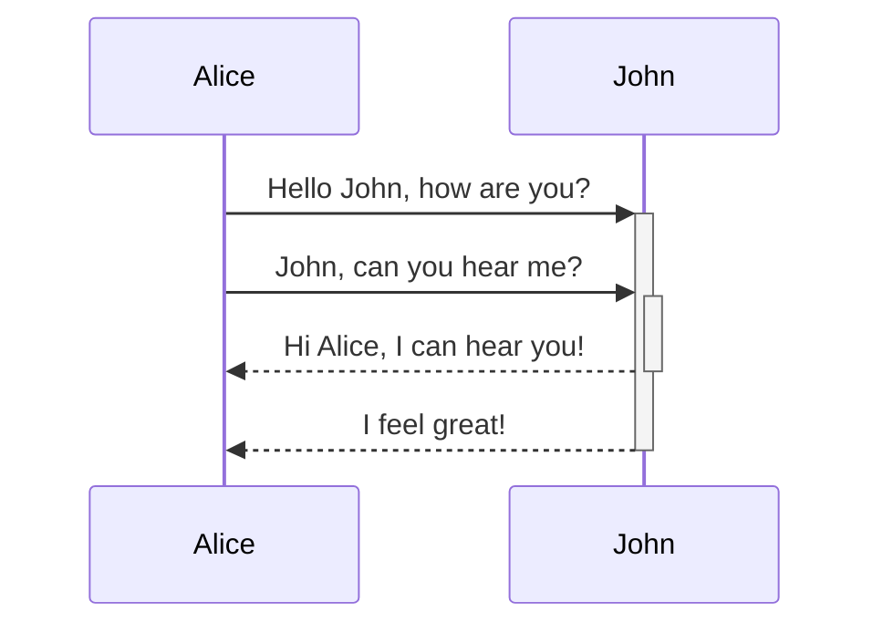

## 🤠 Notes样式语法

### 引用

> [!abstract] abstract

> [!note] note

> [!info] info

> [!question] question

> [!todo] todo

> [!example] example

> [!tip] tip

> [!success] success

> [!warning] warning

> [!failure] failure

> [!danger] danger

> [!bug] bug

### 图表

